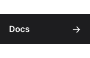
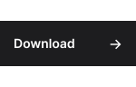

Design+ is a modern UI library for [Roblox](https://create.roblox.com/)

Easily create UI with automattic backgrounds, colors, shadows, icons, text, gradients and more.. to save thousands of lines of code.

Design+ is formatted l

<a href="https://unexex.github.io/design-plus/">
Visit the Design+ documentation to learn more 
</a>

